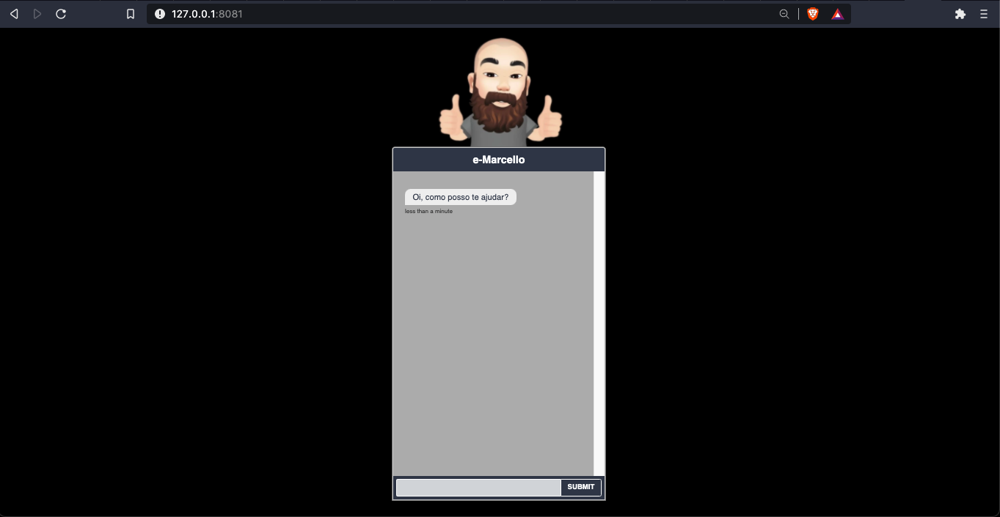
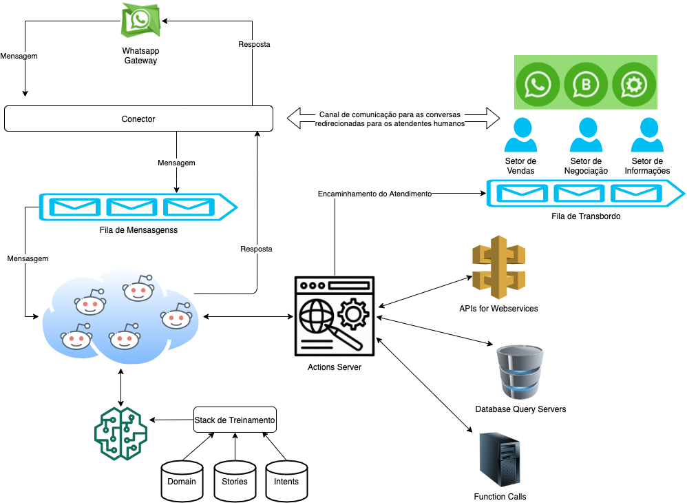
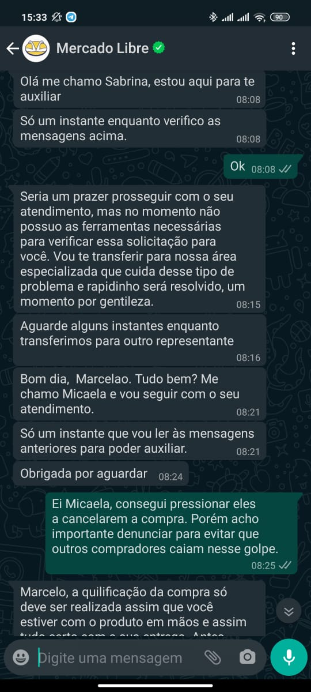
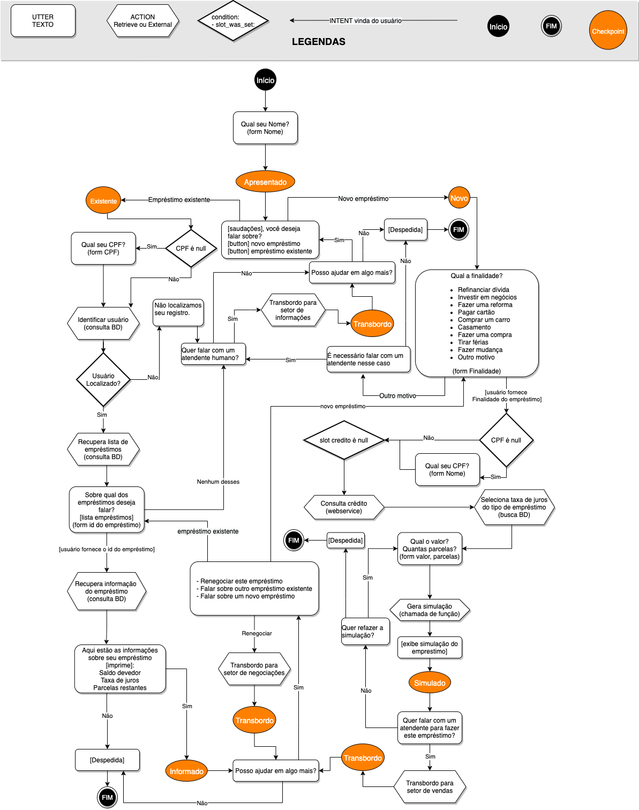

# Desafio Serasa

## Um chatbot para atendimento de dúvidas em uma plataforma de empréstimos


### Escopo

Este projeto visa apresentar uma arquitetura de chatbot escalavél, flexivél e resiliente, capaz de processar um alto volume de dúvidass e estar preparado para aumentos rápidos de demanda.

Devem estar contemplados o transbordo do atendimento para atendentes humanos, caso necesssário, assim como ações que requeiram a consulta à serviços externos, consulta em bases de dados, o uso de custom forms, e também a utilização de fallback actions.

O estudo de caso selecionado foi um Chatbot para atendimento de uma plataforma de emprestimos online, sendo que ele deve ser capaz de sanar as principais dúvidas dos visitantes.

Adicionalmente será tratado o transbordo do atendimento para o setor de informações, o setor de negociações, e também o setor de vendas.


### Instalação e Execução 

Este chatbot de demonstração foi construido com base na plataforma Rasa (https://rasa.com/), utilizando alguns recursos disponibilizados no exemplo Financial-Demo da RasaHQ (https://github.com/RasaHQ/financial-demo), no Rassa Boilerplate (https://github.com/lappis-unb/rasa-ptbr-boilerplate).

Para testar o chatbot foi utilizado o cliente Chatroom da RasaHQ (https://github.com/RasaHQ/chatroom). 



Para facilitar os testes foi gerado um arquivo docker-compose.yml, de forma que os serviços podem ser construídos e iniciados com o comando:

```
docker-compose up
```

Após isso o cliente estará disponível no endereço:
```
http://127.0.0.1:8081
```

### Arquitetura
A arquitetura apresentada nesta seção foi definida considerando que as mensagens chegarão por meio da infraestrutura do Whatsapp, porém tudo foi pensado para ser independente de plataforma e tecnologia.

Conforme as mensagens chegam, elas são inseridas em uma fila de entrada, o que evita indisponibilidade do sistema em situações em que todas as instâncias disponíveis do chatbot estejam ocupadas.

Existem diversas alternativas para se implementar esse tipo de fila, porém a AWS SQS (https://aws.amazon.com/pt/sqs/) parece uma ótima alternativa por apresentar diversos recursos úteis, como a garantia de entrega das mensagens, fácil gerenciamento de múltiplas filas, e mesmo a possibilidade de marcar uma mensagem como "hidden" durante o atendimento e removida após a resposta ser gerada. 

Este último recurso pode ser utilizado de forma criativa como mecanismo inteligênte de lock, pois é possivel definir um timeout para o processamento de uma mensagem, de forma que ele volta a ser visivél na fila caso não um chatbot não consiga processa-la em tempo hábil por qualquer motivo.




Outro recurso que pode ser incorporado à esta arquitetura é a persistência de contexto, o que possibilita que qualquer instância do chatbot disponível possa processar uma assumir um atendimento caso o chatbot atual se torne indisponível por algum motivo, reconstruindo o contexto até a ultima mensagem processada. Isso pode aumentar a disponibilidade do sistema e mesmo ser utilizado para compartilhar o contexto das conversas entre chatbots e atendentes humanos durante uma situação de transbordo.

Por meio dessa mesma técnica é possível realizar o transbordo do atendimento, porém mantendo o canal de comunicação, de forma que o visitante terá uma experiência similar a se um atendente entregasse o smartphone ao colega para que ele continue o atendimento.

Outro ponto relacionado com a disponibilidade do serviço é a segunda fila de mensagens, utilizadas quando um atendimento é transferido para um atendente humano. Quando isso ocorre o próximo atendente disponível (no departamento especificado) receberá o token da conversa e o conector passa enviar as mensagens direto para o novo canal. Caso o atendente transfira o visitante novamente para o bot, o conector passa a novamente a direcionar as mensagens daquele atendimento para a fila de entrada.

Por questões práticas de tempo esta arquitetura não foi implementada no chatbot de demonstração.

### Alternativas para realizar o Transbordo

A arquitetura desscrita possibilita algumass formas diferentes para tratar a transição do antendimento entre um chatbot e um atendente humano. A seguir serão descritas duas dela.

* Encaminhamento para outro canal
* Realizar o atendimento híbrido no mesmo canal

**Obs**: algumas idéias dessa seção foram baseadas no artigo: 

* https://www.take.net/blog/chatbots/atendimento-humano-em-chatbots


#### Encaminhamento para outro canal

Embora eu ainda não esteja certo da técnica atualmente utilzada na Serasa, acredito que se enquadre nesa categoria. 

Essa técnica é interessante pois possibilita liberar o canal de atendimento ao redirecionar o usuário para um canal externo como o telefone ou email. 


A desvantagem nessse casso fica por conta da experiência do usuário por ter que utilizar um canal adicional de comunicação, e também por conta do atendente humano perder o contexto da mensagem.

Todavia existem algumas formas de incrementar esssa abordagem, como a criação de external actions para persistir temporáriamente e enviar (ou tornar acesível) o contexto para o próximo atendente.


#### Realizar o atendimento híbrido no mesmo canal

Essa estratégia é a que parece ressultar em melhor experiência do usuário, pois permite que seja utilizado o mesmo canal de comunicação o tempo todo. Tanto ao transferir do chatbot para o atendente, transferir de uma atendente para o outro, e transferir do atendente de volta para o chatbot.




Outra vantagem é que o contexto é presenvado a cada transferência, de forma que o usuário não precissa repetir as informações para cada novo atendente.

Todavia é uma estratégia mais difícil de implementar pois exige um maior grau de integração e customização dos componentes.

Uma forma de implementar isso seria por meio da persistência de contexto um sistema de lock compartilhado com infomações adicionais descrevendo a cadeia de atendimento. Dessa forma é possível retornar o atendimento para qualquer chatbot ou atendente que participou da conversa com o usuário.

### Retrieval Actions e External Events

Para a implementação do chatbot foi necessário definir algumas ações relacionadas com a recuperação de informação e o transbordo dos atendimentos.

Durante o fluxo da conversa pode ser necessário que o chatbot dispare uma ou mais das ações:

* **Verificação do usuário:** busca em um banco de dados para verificar os dados do visitante e descobrir se ele já realizou emprestimos anteriores na plataforma.
* **Consulta de empréstimos**: busca em um banco de dados para recuperar todos os emprestimos já realizados por um usuário (ativos e finalizados), recuperando o saldo devedor e taxa de juros de cada um deles.
* **Buscar taxa de juros:** pesquisar em uma base de dados para recuperar a taxa de juros de uma determinada modalidade de empréstimo.
* **Consulta de crédito:** consultar um webservice para recuperar o score de crédito de um visitante. (para simular isso foi utilizazda uma busca no banco de dados)
* **Gerar simulação:** é feita uma chamada de função para calcular o valor de cada parcela em uma simulação de empréstimo.
* **Transbordo:** faz uma chamada no sistema para transferir o atendimento para um atendente humano. (para simular isso foi criada uma ação para imprimir as mensagens de Inicio e Final do atendimento humano, e retornar para o fluxo da conversa)

### Fallbacks e Out of Scope

A continuidade da conversa é algo essencial para uma boa experiência do usuário. Dessa forma, devemos evitar a quebra do dialogo por conta de perguntas fora de contexto que o usuário possa fazer, assim como por conta de falha de entendimento ou baixa confiabilidade no reconhecimento de intents.

Para tratar as perguntas e comentários fora de contexto foi criada a intent **out_of_scope**, que será treinada para reconhecer piadas, testes e perguntas fora do contexto da platarma ded emprestimos.

```
nlu.yml
nlu:
- intent: out_of_scope
  examples: |
    - Você entrega comida?
    - Chame um Uber pra mim
    - Qual o sentido da vida
    - Quanto é 2+2
    - ...
```

Para a intent **out_of_escope** será definida uma resposta padrão, solicitando que o visitante retorne ao fluxo da conversa:

```
domain.yml
responses:
  utter_out_of_scope:
  - text: Me desculpe, mas realmente precisamos continuar nosso atendimento.
```

Finalmente, foi criada uma regra para exibir a mensagem padrão toda vez que é detectada a intent **out_of_scope**:

```
rules.yml
rules:
- rule: out-of-scope
  steps:
  - intent: out_of_scope
  - action: utter_out_of_scope
```


Por sua vez, os fallbacks precisam ser tratados dentro do contexto. Tratando o fallback dentro do contexto da conversa é possível instruir o visitante sobre como deve responder as perguntas, aumentando a chance de satisfação ao final do atendimento.

TO-DO


### Forms, Slots e Botões

Durante o fluxo da conversa são necessários alguns dados como o nome e cpf do usuário, e em partes específicas são necessários ainda outros dados como o valor do empréstimo solicitado e o número desejado de parcelas.

Para capturar esses dados de uma maneira estruturada foram utilizados forms, para popular slots que são as nossas variáveis.

Quando as possibilidades a serem escolhidas são limitadas e bem definidas, o uso de botões evita problemas desnecessários de comunicação.

TO-DO

### Workflow dos Diálogos


A imagem a seguir ilustra o fluxo da conversa durante a execução do chatbot. Vale resaltar que na imagem não estão representadas as exeções ou ações de fallback, apenas a visão geral dos possíveis fluxos normais da conversa.




### Descrição das Stories


A seguir serão listadas e descritas cada uma das stories previstas na conversação. As ações, decisões e tratamentos de excessões serão descritos em alto nível, assim como a especificação dos serviços utilizados também serão conceituais.


#### Seção A: Stories sem transbordo humano

Nessas seção serão descritas as stories que envolvem apenas o chatbot e o usuário, sem a necesssidade de recorrer aos atendentes humanos.

TO-DO

##### Story A1: um visitante deseja informações sobre os parcelas e taxas para um empréstimo já sabendo o valor desejado e prazos desejados, mas não deseja contratar o empréstimo no momento.

dasda


##### Story A2: um visitante deseja informações sobre os parcelas e taxas para um empréstimo, porém ele deseja simular diferentes valores e prazos. Porém ele não deseja contratar o empréstimo no momento.

dasda


##### Story A3: um visitante deseja informações sobre o saldo devedor e taxa juros de um empréstimo que ele já contratou.

dasda


##### Story A4: um visitante deseja informações sobre o saldo devedor e taxa juros de multiplos empréstimos que ele já contratou.

dasda


##### Story A5: um visitante deseja informações sobre o saldo devedor e taxa juros de um empréstimo que ele já contratou. Após receber as informações ele decide contratar um novo empréstimo para quitar a dívida.

dasda


### Conclusão

Apesar de todos os possíveis fuxos de atendimento terem sido apressentados, apena alguns deles foram implementados nessa verssão de demonstração.

TO-DO

