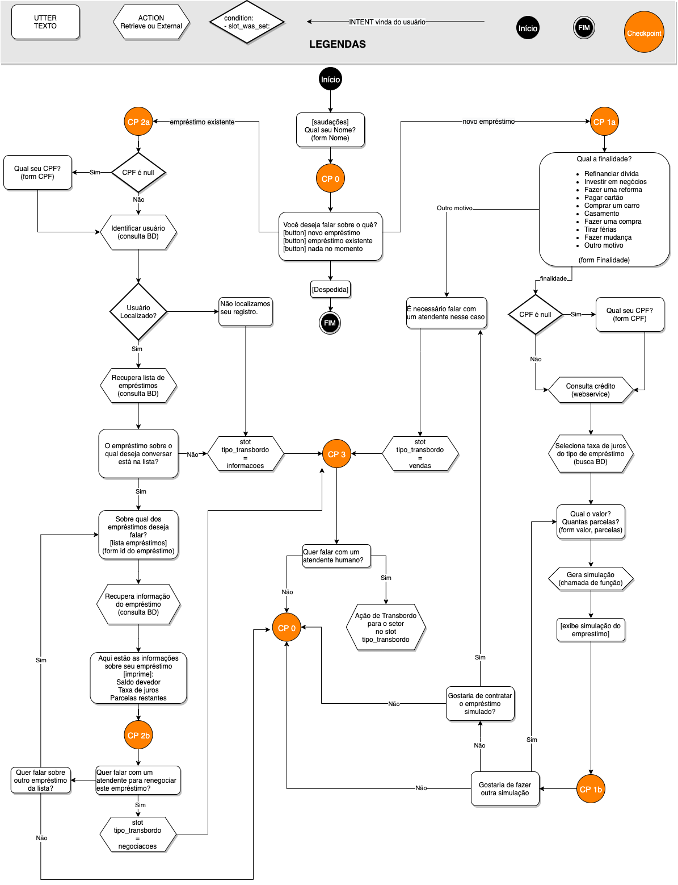

# Desafio Serasa

## Um chatbot para atendimento de dúvidas em uma plataforma de empréstimos
[Escopo](#escopo) | [Instalação](#instalacao) | [Arquitetura](#arquitetura) | [Fallbacks](#fallbacks) | [Transbordo](#transbordo) | [Ações](#actions)| [Forms](#forms) | [Stories](#stories)| [Conclusão](#conclusao)


### <a name="escopo"></a>Escopo

Este projeto visa apresentar uma arquitetura de chatbot escalavél, flexivel e resiliente, capaz de processar um alto volume de dúvidass e estar preparado para aumentos rápidos de demanda.

Devem estar contemplados o transbordo do atendimento para atendentes humanos, caso necesssário, assim como ações que requeiram a consulta à serviços externos, consulta em bases de dados, o uso de custom forms, e também a utilização de fallback actions.

O estudo de caso selecionado foi um chatbot para atendimento de uma plataforma de emprestimos online, sendo que ele deve ser capaz de sanar as principais dúvidas dos visitantes.

Adicionalmente será tratado o transbordo do atendimento para o setor de informações, o setor de negociações, e também o setor de vendas.

Para entender alguns termos e as modalidades de empréstimos foi consultada a plataforma de empréstimos [Geru](https://www.geru.com.br).


### <a name="instalacao"></a> Instalação e Execução

Este chatbot de demonstração foi construido com base na plataforma [Rasa](https://rasa.com/), utilizando alguns recursos disponibilizados no exemplo [Financial-Demo da RasaHQ](https://github.com/RasaHQ/financial-demo), no [Rassa Boilerplate](https://github.com/lappis-unb/rasa-ptbr-boilerplate).

Para testar o chatbot foi utilizado o cliente [Chatroom da RasaHQ](https://github.com/RasaHQ/chatroom). 


Para facilitar os testes foi gerado um arquivo docker-compose.yml, de forma que os serviços podem ser construídos e iniciados com o comando:

```
docker-compose up
```

Após isso o cliente estará disponível no endereço:
```
http://127.0.0.1:8081
```


### <a name="arquitetura"></a>Arquitetura

A arquitetura apresentada nesta seção foi definida considerando que as mensagens chegarão por meio da infraestrutura do Whatsapp, porém tudo foi pensado para ser independente de plataforma e tecnologia.

Conforme as mensagens chegam, elas são inseridas em uma fila de entrada, o que evita indisponibilidade do sistema em situações em que todas as instâncias disponíveis do chatbot estejam ocupadas.

Existem diversas alternativas para se implementar esse tipo de fila, porém a [AWS SQS](https://aws.amazon.com/pt/sqs) parece uma ótima alternativa por apresentar diversos recursos úteis, como a garantia de entrega das mensagens, fácil gerenciamento de múltiplas filas, e mesmo a possibilidade de marcar uma mensagem como "hidden" durante o atendimento e removida após a resposta ser gerada. 

Este último recurso pode ser utilizado de forma criativa como mecanismo inteligênte de lock, pois é possivel definir um timeout para o processamento de uma mensagem, de forma que ele volta a ser visivél na fila caso não um chatbot não consiga processa-la em tempo hábil por qualquer motivo.


Outro recurso que pode ser incorporado à esta arquitetura é a persistência de contexto, o que possibilita que qualquer instância do chatbot disponível possa processar uma assumir um atendimento caso o chatbot atual se torne indisponível por algum motivo, reconstruindo o contexto até a ultima mensagem processada. Isso pode aumentar a disponibilidade do sistema e mesmo ser utilizado para compartilhar o contexto das conversas entre chatbots e atendentes humanos durante uma situação de transbordo.

Por meio dessa mesma técnica é possível realizar o transbordo do atendimento, porém mantendo o canal de comunicação, de forma que o visitante terá uma experiência similar a se um atendente entregasse o smartphone ao colega para que ele continue o atendimento.

Outro ponto relacionado com a disponibilidade do serviço é a segunda fila de mensagens, utilizadas quando um atendimento é transferido para um atendente humano. Quando isso ocorre o próximo atendente disponível (no departamento especificado) receberá o token da conversa e o conector passa enviar as mensagens direto para o novo canal. Caso o atendente transfira o visitante novamente para o bot, o conector passa a novamente a direcionar as mensagens daquele atendimento para a fila de entrada.

Por questões práticas de tempo e recursos esta arquitetura não foi implementada no chatbot de demonstração.


### <a name="transbordo"></a>Alternativas para realizar o Transbordo

A arquitetura desscrita possibilita algumass formas diferentes para tratar a transição do antendimento entre um chatbot e um atendente humano. A seguir serão descritas duas dela.

* Encaminhamento para outro canal
* Realizar o atendimento híbrido no mesmo canal

Obs: algumas idéias dessa seção foram baseadas no artigo: 

* [https://www.take.net/blog/chatbots/atendimento-humano-em-chatbots](https://www.take.net/blog/chatbots/atendimento-humano-em-chatbots)


#### Encaminhamento para outro canal

Embora eu ainda não esteja certo da técnica atualmente utilzada na Serasa, acredito que se enquadre nesa categoria. 

Essa técnica é interessante pois possibilita liberar o canal de atendimento ao redirecionar o usuário para um canal externo como o telefone ou email. Isso funciona bem para os casos em que o atendente humano finaliza a conversa quando termina de atender o cliente.


A desvantagem nessse casso fica por conta da experiência do usuário por ter que utilizar um canal adicional de comunicação, e também por conta do atendente humano perder o contexto da mensagem.

Todavia existem algumas formas de incrementar esssa abordagem, como a criação de external actions para persistir temporáriamente e enviar (ou tornar acesível) o contexto para o próximo atendente.


#### Realizar o atendimento híbrido no mesmo canal

Essa estratégia é a que parece ressultar em melhor experiência do usuário, pois permite que seja utilizado o mesmo canal de comunicação o tempo todo. Tanto ao transferir do chatbot para o atendente, transferir de uma atendente para o outro, e transferir do atendente de volta para o chatbot.


Outra vantagem é que o contexto é presenvado a cada transferência, de forma que o usuário não precissa repetir as informações para cada novo atendente.

Todavia é uma estratégia mais difícil de implementar pois exige um maior grau de integração e customização dos componentes.

Uma forma de implementar isso seria por meio da persistência de contexto um sistema de lock compartilhado com infomações adicionais descrevendo a cadeia de atendimento. Dessa forma é possível retornar o atendimento para qualquer chatbot ou atendente que participou da conversa com o usuário.

### <a name="actions"></a>Retrieval Actions e External Events

Para a implementação do chatbot foi necessário definir algumas ações relacionadas com a recuperação de informação e o transbordo dos atendimentos.

Durante o fluxo da conversa pode ser necessário que o chatbot dispare uma ou mais das ações:

* **Verificação do usuário:** busca em um banco de dados para verificar os dados do visitante e descobrir se ele já realizou emprestimos anteriores na plataforma.
* **Consulta de empréstimos**: busca em um banco de dados para recuperar todos os emprestimos já realizados por um usuário (ativos e finalizados), recuperando o saldo devedor e taxa de juros de cada um deles.
* **Buscar taxa de juros:** pesquisar em uma base de dados para recuperar a taxa de juros de uma determinada modalidade de empréstimo.
* **Consulta de crédito:** consultar um webservice para recuperar o score de crédito de um visitante. (para simular isso foi utilizazda uma busca no banco de dados)
* **Gerar simulação:** é feita uma chamada de função para calcular o valor de cada parcela em uma simulação de empréstimo.
* **Transbordo:** faz uma chamada no sistema para transferir o atendimento para um atendente humano. (para simular isso foi criada uma ação para imprimir as mensagens de Inicio e Final do atendimento humano, e retornar para o fluxo da conversa)


### <a name="fallbacks"></a>Out of Scope e Fallbacks

A continuidade da conversa é algo essencial para uma boa experiência do usuário. Dessa forma, devemos evitar a quebra do dialogo por conta de perguntas fora de contexto que o usuário possa fazer, assim como por conta de falha de entendimento ou baixa confiabilidade no reconhecimento de intents.

Para tratar as perguntas e comentários fora de contexto foi criada a intent **fora_do_escopo**, que será treinada para reconhecer piadas, testes e perguntas fora do contexto da platarma ded emprestimos.

```
nlu.yml
nlu:
- intent: fora_do_escopo
  examples: |
    - Você entrega comida?
    - Chame um Uber pra mim
    - Qual o sentido da vida
    - Quanto é 2+2
    - ...
```

Para a intent **fora_do_escopo** será definida uma resposta padrão, solicitando que o visitante retorne ao fluxo da conversa:

```
domain.yml
responses:
  utter_fora_do_escopo:
  - text: Me desculpe, mas realmente precisamos continuar nosso atendimento.
```

Finalmente, foi criada uma regra para exibir a mensagem padrão toda vez que é detectada a intent **fora_do_escopo**:

```
rules.yml
rules:
- rule: fora-do-escopo
  steps:
  - intent: fora_do_escopo
  - action: utter_fora_do_escopo
```


Além de sentenças fora do escopo também podem ocorrer casos em que o módulo de NLU não compreende, com grau de confiabilidade suficiente, o que foi dito pelo usuário. Nesses casos é mais interessante assumir que o chatbot não entender o que o visitante disse do que assumir o risco re realizar uma ação incorreta.

Esse tratamento é feito pela política de fallback que, se bem utilizada, pode ajudar a promover a continuidade da conversa nesses casos. Nesse projeto foram utilizadas as recomendação contidas na documentação da Rasa sobre como tratar o fallback [(https://rasa.com/docs/rasa/fallback-handoff)](https://rasa.com/docs/rasa/fallback-handoff/).

Para configurar esse **fallback de 2 estágios** foram seguidos os passos:

1.  foi configurado o **FallbackClassifier** e foi adicionada a **RulePolicy** :

```
config.yml
pipeline:
- name: FallbackClassifier
  threshold: 0.7
  
policies:
- name: RulePolicy
```

2. Foi definida a mensagem que será apresentada ao visitante em caso de fallback. A estratégia adotada é solicitar que ele tente repetir sua sentença de uma outra forma:

```
domain.yml
responses:
  utter_fallback:
  - text: Eu não consegui entender. Poderia escrever de outra forma?
```

3. Foi criada a ação customizada que exibe a **utter_fallback** e retorna para o diálogo anterior, dando a oportunidade do usuário tentar se expressar novamente de uma outra forma.

```
actions.py
from typing import Any, Text, Dict, List
from rasa_sdk import Action, Tracker
from rasa_sdk.events import UserUtteranceReverted
from rasa_sdk.executor import CollectingDispatcher

class ActionDefaultFallback(Action):
    def name(self) -> Text:
        return fallback_action

    async def run(
        self,
        dispatcher: CollectingDispatcher,
        tracker: Tracker,
        domain: Dict[Text, Any],
    ) -> List[Dict[Text, Any]]:
        dispatcher.utter_message(template="utter_fallback")
        return [UserUtteranceReverted()]
```

Por fim, foi criada uma regra para exibir esta mensagem toda vez que ocorre um fallback:

```
rules.yml
rules:
- rule: Pede para o usuário refazer a sentença em caso de fallback
  steps:
  - intent: nlu_fallback
  - action: fallback_action
  - active_loop: fallback_action
```


### <a name="forms"></a>Forms, Slots e Botões

Durante o fluxo da conversa são necessários alguns dados como o nome e cpf do usuário, e em partes específicas são necessários ainda outros dados como o valor do empréstimo solicitado e o número desejado de parcelas.

Os forms são ferramentas muito boas para capturar esses dados, perguntando os dados requeridos, um por um, até que estejam preenchidos. Durante a aplicação de um form, caso o usuário não forneça um valor condizente com o dado solicitado, a pergunta é repetida até que seja fornecido um valor aceitável.

Os dados capturados são armazenados em slots, que se comportam de forma semelhante às variaveis, de maneira que se pode definir um slot para armazenar cada um dos dados. Os forms podem ser ainda mais efetivos se usados em conjunto com botões quando se espera respostas fechadas.

Quando as possibilidades a serem escolhidas são limitadas e bem definidas, o uso de botões evita problemas desnecessários de comunicação pois deixa clara para o chatbot qual a intent do usuário. Nesse estudo de caso isso é usado quando é necessário saber se o visitante quer falar sobre um novo empréstimo ou um empréstimo já existente:

```
  utter_tipo_de_antendimento:
  - buttons:
    - payload: emprestimo_existente
      title: Empréstimo já realizado
    - payload: emprestimo_novo
      title: Novo empréstimo
    text: Você quer tirar dúvidas sobe um empréstimo já realizado ou sobre um novo empréstimo?
```

Também foi possível utilizar os botões para preencher slot com valores específicos. Sendo assim, é possível utilizar os botões em conjunto com os forms para preencher de maneira mais efetiva os slots que possuam respostas restritas a um conjunto finito de valores, como no caso da finalidade do empréstimo:

```
  utter_finalidade_do_emprestimo:
  - buttons:
    - payload: /escolhe_finalidade{"finalidade": "refinanciar_divida"}
      title: Refinanciar uma dívida
    - payload: /escolhe_finalidade{"finalidade": "investir_em_negocio"}
      title: Investir em um negócio
    - payload: /escolhe_finalidade{"finalidade": "fazer_reforma"}
      title: Fazer uma reforma
    - payload: /escolhe_finalidade{"finalidade": "pagar_cartao"}
      title: Pagar cartão de crédito
    - payload: /escolhe_finalidade{"finalidade": "comprar_carro"}
      title: Comprar um carro
    - payload: /escolhe_finalidade{"finalidade": "casamento"}
      title: Casamento
    - payload: /escolhe_finalidade{"finalidade": "fazer_compra"}
      title: Fazer uma compra
    - payload: /escolhe_finalidade{"finalidade": "tirar_ferias"}
      title: Tirar férias
    - payload: /escolhe_finalidade{"finalidade": "fazer_mudanca"}
      title: Fazer mudança
    - payload: /escolhe_finalidade{"finalidade": "outro"}
      title: Outro motivo
    text: Para qual finalidade você quer o empréstimo?
```


### <a name="stories"></a>Regras


As regras podem ser utizadas na generalização de fluxos que podem ocorrer independente do contexto da conversa. Nessa demonstração foram adicionadas algumas regras simples para ilustrar o seu uso. 

```
rules:
- rule: fora-do-escopo
  steps:
  - intent: fora_do_escopo
  - action: utter_fora_do_escopo

- rule: responde-elogio
  steps:
  - intent: elogios
  - action: utter_elogios

- rule: responde-feedback
  steps:
  - intent: feedback
  - action: utter_feedback

- rule: responde-cancelar
  steps:
  - intent: cancelar
  - action: utter_cancelar
```


### <a name="stories"></a>Descrição das Stories


A imagem a seguir ilustra o fluxo da conversa durante a execução do chatbot. Vale resaltar que na imagem não estão representadas as exeções ou ações de fallback, apenas a visão geral dos possíveis fluxos normais da conversa.

Os checkpoints podem facilitar conssideravelmente o controle do floco da conversa. Foram inseridos alguns desses checkpoints no fluxo do diálogo, porém a posição deles pode melhorar, e também podem ser definidos novos checkpoints.




A seguir serão listadas e descritas cada uma das stories previstas na conversação. As ações, decisões e tratamentos de excessões serão descritos em alto nível, assim como a especificação dos serviços utilizados também serão conceituais.


#### Story 01: cumprimento inicial.

Ao receber um cumprimento o chatbot responde a ele, e o progresso é registrado para liberar o fluxo para as próximas ações.

```
- story: cumprimentar
  steps:
  - intent: cumprimentar
  - action: utter_cumprimentar
  - checkpoint: check_cumprimento
```


#### Story 02: ler nome.

Após o cumprimento inicial o chatbot pergunta o nome do usuário e o armazena em um slot. Foi utilizado um form para persistir na pergunta até que o usuário forneça seu nome.

```
- story: ler nome
  steps:
  - checkpoint: check_cumprimento
  - action: utter_perguntar_nome
  - action: form_usuario
  - checkpoint: check_nome_ok
```


#### Stories 03 e 04: seleciona tipo de atendimento

Uma vez que o chatbot conhece o nome do usuário, ele pergunta qual é o tipo de atendimento desejado. O usuário então escolhe entre um Novo Empréstimo e um Empréstimo Existente.

Para facilitar a leitura da escolha foram utilizados botões para das suas opções, e dependendo da opção é registrado um checkpoint para o inicio do próximo diálogo.

```
  utter_tipo_de_antendimento:
  - buttons:
    - payload: emprestimo_novo
      title: Empréstimo já realizado
    - payload: emprestimo_existente
      title: Novo empréstimo
    text: Você quer tirar dúvidas sobe um empréstimo já realizado ou sobre um novo empréstimo?
```


```
- story: selecionar novo emprestimo
  steps:
  - checkpoint: check_nome_ok
  - action: utter_tipo_de_antendimento
  - intent: emprestimo_novo
  - checkpoint: check_emprestimo_novo
```


```
- story: selecionar emprestimo existente
  steps:
  - checkpoint: check_nome_ok
  - action: utter_tipo_de_antendimento
  - intent: emprestimo_existente
  - checkpoint: check_emprestimo_existente
```


#### Story 05: simular novo emprestimo

Se o fluxo da conversa está posicionado no checkmark relativo ao atendimento para um novo empréstimo, o chatbot perunta ao usuário qual a finalidade do empréstimo. Isso é feito pois a finalizada impacta na taxa de juros.

Para ler a finalidade para um slot é utilizado um form, e as alternativas são exibidas ao usuário por meio do utter da pergunta. Também foi utilizado um botão, mas dessa vez foi utilizado um payload com um valor diferente em cada opção no lugar de ter intents diferentes para uma delas.

Caso o slot cpf ainda não esteja populado, é utilizado um form para ler este dado e em seguida, caso o slot do score de crédito não esteja populado, é chamada uma ação externa para recuperar o score por meio de um webservice.

Depois disso é disparada uma ação que busca no banco de dados a taxa de juros com base no score e na finalidade do emprestimo, e assim é preenchido o slot taxa_de_juros.

Em seguida é utilizado um form para ler do usuário o valor desejado para o emprestimo, assim como o número de parcelas, e com base nos dados conhecidos é chamada uma ação personalizada que calcula o valor das parcelas do emprestimo.

Finalmente é exibido ao usuário os dados do emprestimos, e é registrado um checkmark que localiza o diálogo no final da simulação.

```
- story: simular novo emprestimo
  steps:
  - checkpoint: check_emprestimo_novo
  - action: utter_finalidade_do_emprestimo
  - action: form_finalidade
  - action: get_score
  - action: get_taxa
  - action: calc_parcelas
  - checkpoint: check_simulado
```


#### Stories 06 e 07 : fazer uma nova simulação ou contratar o empréstimo (finalidade: Outro motivo)

Se a finalidade do emprestimo é "Outro motivo", é informado a ele que deve conversar com um atendente pois se trata de um caso diferenciado. Caso ele concorde, é realizada uma ação de transbordo e é marcado o checkmark de transbordo.

```
- story: simular novo emprestimo (outro motivo): transbordo
  steps:
  - checkpoint: check_emprestimo_novo
  - action: utter_finalidade_do_emprestimo
  - action: form_finalidade
  - action: utter_transbordo_informacoes
  - intent: confirmacao
  - action: transbordo_para_informacoes
  - checkpoint: check_transbordo
```

Caso ele não concorde, o chatbot sse despede e o atendimento é finalizado.

```
- story: simular novo emprestimo (outro motivo): finalizar
  steps:
  - checkpoint: check_emprestimo_novo
  - action: utter_finalidade_do_emprestimo
  - action: form_finalidade
  - action: utter_transbordo_informacoes
  - intent: negacao
  - action: despedida
  - checkpoint: check_nome_ok
```


#### Stories 08, 09 e 10: fazer uma nova simulação ou contratar o empréstimo

Se o diálogo estiver no checkpoint de final da simulação, é perguntado ao usuário se ele deseja se ele deseja falar com um atendente para realizar o empréstimo. Caso ele concorde, é executada uma ação de transbordo para um funcionário do setor de vendas, e é marcado o checkmark de transbordo.

```
- story: transbordo para contratar o empréstimo
  steps:
  - checkpoint: check_simulado
  - action: utter_contratar_emprestimo
  - intent: confirmacao
  - action: transbordo_para_vendas
  - checkpoint: check_transbordo
```

Caso contrário, é perguntado ao usuário se ele quer realizar outra simulação. Escolhendo sim, o chatbot pergunta a ele o novo valor e novo prazo do empréstimo, e as parcelas são calculadas, e o resultado é exibido para ele. O checkmark continua no final da simulação.

```
- story: nova simulacao
  steps:
  - checkpoint: check_simulado
  - action: utter_contratar_emprestimo
  - intent: negacao
  - action: form_novo_emprestimo
  - intent: confirmacao
  - action: get_taxa
  - action: calc_parcelas
  - action: utter_simulacao
```

Escolhendo não, o chatbot se despede e encerra o atendimento.

```
- story: nova simulacao: finalizar
  steps:
  - checkpoint: check_simulado
  - action: utter_contratar_emprestimo
  - intent: negacao
  - action: form_novo_emprestimo
  - intent: negacao
  - action: utter_despedida
  - checkpoint: check_nome_ok
```


#### Story 11: obter informações de um empréstimo existente, sem empréstimos no BD

Caso o usuário tenha escolhido o atendimento para um empréstimo existente, é solicitado o seu cpf (caso o slot ainda não esteja populado), e em seguida este dado é utilizado em uma ação que busca em um banco de dados todos os empréstimos existentes daquele usuário.

Caso não seja localizado nenhum empréstimo é oferecido ao usiário a chance de falar com um atendente humano. Se ele escolher este este caminho é disparada uma ação que realizará o transbordo para um atendente do setor de informações, e é registrado o checkpoint no transbordo.

```
- story: emprestimo existente com transbordo
  steps:
  - checkpoint: check_emprestimo_novo
  - action: utter_finalidade_do_emprestimo
  - action: form_finalidade
  - action: get_score
  - action: get_taxa
  - action: calc_parcelas
  - checkpoint: check_simulado
```

